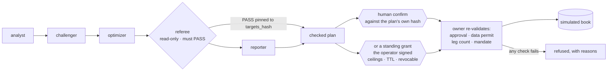

# qlab — a governed agentic quant research desk

qlab turns research questions into reproducible portfolio experiments, promotes
only reviewed decisions, and books approved paper trades through one auditable
runtime.

The whole design is one boundary:

- **AI agents own judgment** — estimation windows, challenge cases, what the
  news supports.
- **Algorithms own numbers** — estimation, optimization, backtesting, metrics.
- **Deterministic code owns rigor** — point-in-time checks, the mandate, the
  referee gate, execution idempotency, the audit trail.

Nothing an agent says can move that boundary. That is the point of the project.

[](https://youtu.be/AFBifFmD0Tk)

**▶ [Watch the demo](https://youtu.be/AFBifFmD0Tk)** — a checked allocation
going from referee PASS to a booked fill through one human confirmation, and a
predictor board that reports its own null result.

## AI Builders Challenge — Wildcard submission

|  |  |
|---|---|
| **Theme** | Wildcard — Build Intelligent Systems for the Future of Work |
| **Category fit** | AI co-workers · decision intelligence · workflow orchestration |
| **Demo** | **[youtu.be/AFBifFmD0Tk](https://youtu.be/AFBifFmD0Tk)** (2:48) |
| **Primary development tool** | IBM Bob |
| **Status** | Paper trading only. The book is simulated; no real money moves. |

### Problem statement

The best portfolio methods are not secret. Shrinkage estimation, regime
detection, hierarchical risk parity, CVaR optimisation — these are what
institutional desks actually run, and decades of published research back them.
For most individual investors they may as well not exist, because using them
well needs expertise most people never get the chance to build: which estimator
suits which regime, how to backtest without fooling yourself, how to read a news
record instead of reacting to headlines. So capable people fall back on gut
feel, generic index products, or copy-trading.

AI can carry that expertise. What has been missing is the structure around it —
grounding for its claims, an audit trail for its reasoning, and a hard line
between advising and executing. The barrier is no longer information. It is
trustworthy access.

### Solution description

qlab is a personal quant desk that runs in a terminal, with AI supplying the
expertise and deterministic code supplying the discipline. An agent chooses the
estimation window and argues the regime call; an algorithm solves the
allocation; deterministic code enforces the mandate, binds the referee's verdict
to the exact weights it approved, and refuses any execution without a matching
approval the operator authorized — per plan, or in advance through a bounded
standing grant. No agent has an order tool, and no code path would give one.

- **Twenty instruments, by contract.** Anything outside `mandate.yaml` is
  rejected before a plan can form.
- **Evidence over novelty.** The predictor board ranks seven models against
  their own control and reports whether the winner means anything — on the
  current run it named a champion and then declared the result *not
  established*, because shuffling the target reproduces a champion that good
  about one time in six.
- **Grounded qualitative analysis.** News is read into a point-in-time, hashed
  archive; a view built from it is checked back against that archive, so an
  invented quote or a citation to a record that does not exist raises rather
  than passes ([`view_provenance.py`](qlab/research/view_provenance.py)).
- **A human gate that is not advisory.** Nothing reaches the book until a person
  confirms against a hash of the exact approved weights. Move one number and the
  approval dies. A person may instead sign a **standing grant** — every ceiling
  written out, at most 30 days, revocable in one keystroke — and the desk then
  books what that grant already covers on its own beat. That is still the
  person's authority, given ahead of time rather than per plan; every other gate
  is unchanged.

### AI approach and architecture

Five AI roles walk a governed pipeline. Each role's authority is declared in
`agents/*.md` — one source, projected into both `.claude/agents/` and
`.bob/personas/`. No role has filesystem, shell, or execution tools.



Three properties make this more than a prompt chain. **The phase graph is not
user input** — it is an in-process argument, and the registry validates
dependency closure, so a graph without a referee cannot reach a reporter.
**One process owns the database** — a single owner runtime holds the only DuckDB
handle; every client and MCP server reaches it over HTTP. **Refusal is a
first-class result** — stale data, a moved book, a truncated plan, or a mandate
breach each return a reason rather than an exception, and the demo shows the
desk refusing a human-confirmed execution because the price feed was one session
stale.

Reasoning can run on **IBM Granite** locally through Ollama or on a hosted
model; the authority a role holds does not change with the model behind it.

### How IBM Bob was used

Bob enters qlab as a **client of the governed surface, never an authority inside
it** — the same rule every agent surface here follows.

qlab was designed in Bob before it was written. The boundary the codebase now
enforces, along with the referee gate, the phase graph, and the single-writer
rule, was planned there first, and Bob was returned to mid-build to refine that
architecture as the desk grew; the design record is 56 dated documents in
[`planning-docs/`](planning-docs/), including the ones recording what did *not*
work. Bob carried the early implementation directly, and when its trial
allowance was spent the build continued in Claude Code against the plan Bob had
produced — the governance boundary was already decided, so later work filled it
in rather than renegotiating it.

Wired today: `.bob/mcp.json` connects Bob to `qlab/mcp/tui_proxy.py`, an MCP
server that never opens DuckDB and whose authority is capped at observation,
research, and *dry* previews. Stated plainly: `.bob/personas/*.yaml` is qlab's
own neutral projection, not a format Bob loads — it shows the roles can target a
second orchestrator, it does not yet make Bob run the workforce.
→ **[Bob as a governed client](docs/ibm-bob.md)**

## Setup

```bash
git clone https://github.com/AzAINN/QLAB && cd QLAB
python -m venv .venv && source .venv/bin/activate
python -m pip install -e ".[operator,data,optimize,mcp,dev]"
cd clients/atlas-tui && cargo build --release && cd -
```

That is enough to run the desk offline. Live data and a real Alpaca paper book
need one more step. → **[full install guide](docs/install.md)** — Python, the
Rust toolchain per platform, and the Alpaca CLI

## Using the desk

```bash
qlab
```

That starts the owner runtime and opens the **Atlas workstation** — the
Rust/Ratatui client in `clients/atlas-tui`. It opens on live prices with the
simulated book; every operation is available and no flags are needed. Ten panes,
one per digit, numbered as the nav rail lists them:

| key | pane | what it answers |
|---|---|---|
| `1` | ATLAS | the desk manager: ask it something, see what it would do next |
| `2` | DESK | the one-screen read — equity, regime, allocation, news, verdict |
| `3` | MKTS | the mandate's twenty instruments and their prices |
| `4` | BOOK | positions, drift, the current proposal, and the confirm box |
| `5` | RSCH | every research run, reproducible from its own spec |
| `6` | PRED | the predictor board — models ranked against their control |
| `7` | WORK | the workforce: five roles and the phase they are on |
| `8` | AUDIT | the event bus, and any approval waiting on you |
| `9` | SETT | desk mode, models, method, news sources, rights, standing authority |
| `0` | VIS | research artifacts drawn as text |

Everywhere: `r` refreshes, `/` opens the command line, `?` shows help, `q` quits.

**The loop.** On ATLAS, `/ask` makes the gate rank every registered template —
the WOULD DO panel shows what this desk may start now *and* what it refuses,
with the reason. `/do <template>` approves one, which is what starts a governed
run; approving re-runs the same gate, so nothing creates a paper plan below
Propose. Watch it on `7`. A run that ends in a plan leaves a proposal on BOOK,
where `b` opens one box showing the allocation and the last six of the
`targets_hash` it is bound to, and `Enter` books it.

That is the explicit confirmation, and it is one click, never two. The owner
then re-validates the approval, the plan, the data permit, the leg count, and
the mandate before any fill, and refuses with a reason if any of them moved.
The desk asks about one proposal at a time — a newer checked plan supersedes an
older pending one, and the older approval is invalidated with the reason.

**Standing authority** is the other way that proposal becomes a fill. On SETT,
the AUTHORITY card shows the live grant and what is left of it — days, books
left today, and every ceiling — and `R` revokes it at once, with no box and
nothing typed. While a grant stands, the owner's own 30-second beat books a
proposal the grant covers, with no click; it refuses anything the grant does not
cover, anything an anomaly suspends (a halt, a dirty reconcile, no data permit,
a recent rejected order), a plan older than 120 seconds, and a plan that has
already started. Nothing else is skipped, and no agent can create, read or
consume a grant. Granting is not a keystroke: it is a `POST` to
`/api/desk/authority` that states every ceiling explicitly.

Anything that writes is refused on a desk you have not armed, and on a window
started with `--glass`. → **[every key, by pane](docs/cli.md#keys-by-pane)**

## Atlas

Atlas is the desk manager. It runs on a heartbeat inside the owner, evaluates
deterministic triggers, and composes a **read** across the regime panel, the
news record, and what the workforce concluded. The read leads with **tensions** —
where the evidence disagrees with itself — because that is what a number cannot
say.

A fresh desk starts in `research` mode with autonomy on. Research is the highest
mode that cannot create a paper plan, so Atlas researches unattended without the
execution boundary moving. Dispatching work is not running it, so the owner
starts a governed coordinator for the workflow Atlas registered — one at a time,
with its reasoning republished onto the audit bus so an unattended run is
watchable rather than a black box. One research workflow runs at a time: a
second start is refused by name, so two runs can never leave two allocations
behind.

Atlas also starts work from the chat, within the rights you grant it —
`workflow.start`, `workflow.resume`, `atlas.task.create`, and the read-only
`approvals.list`, and nothing else — and work it queued that nobody answered
expires rather than accumulating.

A held name's public record changing is a trigger, and the template it maps to
is `portfolio_watch`: analyst → **contender-scout** → reporter. The scout has
eyes, not hands — `WebSearch`, `WebFetch`, and two registry decision tools, no
data, solver, or trade tool exists in its grant. Its excerpts reach the desk
only through the provenance-gated news lane, and a contender outside the
universe becomes a `universe_change` approval you answer on AUDIT or from ATLAS.
Nothing it says moves a weight.

Reaching a fill needs `propose` mode **and** either your explicit confirmation
or a standing grant you signed. Atlas has no part in the second one: it cannot
see, create or consume a grant, and its mode never widens what may execute.
→ [Atlas, modes, and the workforce](docs/atlas.md)

## One writer, always

DuckDB is both the research registry and the paper book, and exactly one process
opens it.

```
qlab
    |
    +-- owner HTTP runtime ---- DuckDB registry and paper book
    |       |
    |       +-- the Atlas workstation and the CLI verbs observe over HTTP
    |       +-- qlab-operator gives the Claude workforce role-bound HTTP tools
    |
    +-- paper execution needs the operator's confirmation: one click on the
        hash-bound box, or a standing grant they signed in advance
```

Every other surface talks HTTP. No MCP tool accepts a raw order.
→ [architecture](docs/architecture.md)

## Honest results

qlab records what it measured, including when that is unflattering.

| Result | Status |
|---|---|
| Simple benchmarks beat the MVSK arms out of sample (2018–2026) | MVSK stays research-stage |
| Quantum-inspired feature augmentation hurts the vol forecast — one variant lost 12 of 12 samples | off by default ([write-up](planning-docs/2026-07-30-ml-lane.md)) |
| Multistart's winning basin appears at restart 2–4 against a budget of 100–160 | early stopping: **71s → 6.5s**, identical answers ([write-up](planning-docs/2026-07-30-optimizer-audit.md)) |
| Exact 4-of-7 selection beat HRP on the ablation panel — and picked the same four names at 56 of 57 rebalances | met the gate, stayed research-stage ([write-up](planning-docs/2026-08-31-a6-cardinality-not-promoted.md)) |

The augmentation's *first* measurement looked like a 4× win. It was an artifact
of a cache that ignored its seed, so a robustness sweep silently returned one
repeated sample. Fixed and guarded by a test — a sweep with zero variance is a
broken sweep, not a strong result.

## Clients

| Surface | What it is |
|---|---|
| `qlab` | the Atlas workstation (`clients/atlas-tui`) — Ratatui, armed by default; read-only by construction only in the `--no-default-features` build ([README](clients/atlas-tui/README.md)) |
| `qlab owner` | the same owner runtime, headless — for a desk kept up as a service |
| `qlab desk` / `qlab workforce` / `qlab events` | one-shot CLI verbs over the owner's HTTP and event stream |

The workstation is the desk's one client, and a paper trade booked from it is
held to one rule: exactly one explicit confirmation. It is one click on a box
that *displays* the last six of the plan's own `targets_hash` — the client posts
that hash, the referee PASS is pinned to the same hash, and the owner
re-validates the request and refuses it without a persisted approval. The
workstation is not the only door: under a standing grant the owner books on its
own beat with no client involved, and the workstation's part in that is to
*show* the grant and revoke it (Settings ▸ AUTHORITY, `R`). Whether
this window may write at all is the owner's persisted posture, asked once at
startup — not a launch flag. The same door asks which mind runs Atlas, once, on
a desk whose answer the owner has never recorded; Settings ▸ MODELS is where
it changes after that.

## Running qlab

```bash
qlab                    # the desk: live prices, simulated book
qlab --offline          # the synthetic no-network demo
qlab --alpaca-book      # real prices and your Alpaca paper book
qlab --glass            # keep this window read-only
qlab --restart          # take the desk down from the base up
```

Everything else is a one-shot verb — governed autopilot, the reproducible
ablation, news setup, and the HTTP verbs that are safe alongside a running desk
(`qlab desk`, `qlab workforce`, `qlab events`). → **[the full command
line](docs/cli.md)**

```bash
python -m pytest                       # full offline suite, no network, no accounts
cd clients/atlas-tui && cargo test     # the Rust client, offline fixtures, no owner
```

## Further reading

- [Atlas and the workforce](docs/atlas.md) — modes, autonomy, the coordinator,
  the five governed roles
- [Architecture](docs/architecture.md) — one writer, MCP surfaces, the algorithm
  catalog and its stages, the regime indicators, repo map
- [Data lanes and whose book](docs/data-and-book.md) — providers, Alpaca,
  configuration and state
- [Install guide](docs/install.md) — Python, Rust, and the Alpaca CLI
- [The command line](docs/cli.md) — every verb, and the rights `/cli` and `/build` read
- [News setup](docs/news-setup.md) — making the news window real
- [IBM Bob](docs/ibm-bob.md) — Bob as a governed client of the desk
- [UI validity](UI_VALIDITY.md) — what each surface's numbers do and do not
  support
- [planning-docs/](planning-docs/) — dated status, audits, and superseded plans

## Current direction

Explain *why* MVSK loses before adding solver complexity: lambda sweeps,
estimator sensitivity, bounded news views. The optimizer audit narrowed where to
look — the `n⁴` cokurt tensor is 104 MB at 60 assets, so MVSK is comfortable to
~25 names and should not be attempted past ~50. That is a memory wall, not a
governance preference.

Two smaller measured findings worth acting on: minimum variance pins to the
per-asset cap with an effective 3.7 of 25 positions, so its in-sample volatility
advantage is out-of-sample concentration risk; and the scenario-CVaR LP
overtakes SLSQP past roughly 50 assets while diversifying better.

Cardinality met its pre-registered promotion gate and was not promoted: exact
4-of-7 then min-variance (ablation arm A6) beat HRP on sortino, 0.9485 to
0.6565, with a drawdown 3pp shallower — but it chose the *same* four names at 56
of 57 rebalances, so the arm holds one selection decision rather than 57, and
across four seeds the margin fell from +0.2920 to +0.0034 with the confidence
intervals overlapping. The next evaluation is a 20-name spec whose volatility
profile actually varies across draws, plus an execution path that carries `k`
end to end.

On operations: real Alpaca paper integration, market-calendar scheduling, the
Bob adapters, and porting more of the surface into `atlas-tui`. The
live-on-Alpaca-book path has still never been exercised end to end.

Promotion of any offline experiment into the desk requires evidence, a catalog
stage change, tool review, and new governance tests.

## License

MIT. See LICENSE.
