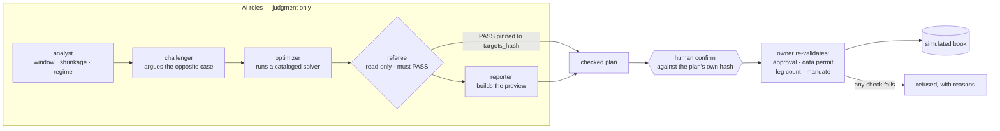

# qlab — a governed agentic quant research desk

qlab turns research questions into reproducible portfolio experiments, promotes
only reviewed decisions, and books approved paper trades through one auditable
runtime.

The whole design is one boundary:

- **AI agents own judgment** — estimation windows, challenge cases, what the
  news supports.
- **Algorithms own numbers** — estimation, optimization, backtesting, metrics.
- **Deterministic code owns rigor** — point-in-time checks, the mandate, the
  referee gate, execution idempotency, the audit trail.

Nothing an agent says can move that boundary. That is the point of the project.

[](https://youtu.be/AFBifFmD0Tk)

**▶ [Watch the demo](https://youtu.be/AFBifFmD0Tk)** — a checked allocation
going from referee PASS to a booked fill through one human confirmation, and a
predictor board that reports its own null result.

## AI Builders Challenge — Wildcard submission

|  |  |
|---|---|
| **Challenge theme** | Wildcard — Build Intelligent Systems for the Future of Work |
| **Category fit** | AI co-workers · decision intelligence · workflow orchestration |
| **Demo video** | **[youtu.be/AFBifFmD0Tk](https://youtu.be/AFBifFmD0Tk)** (2:48) |
| **Primary development tool** | IBM Bob |
| **Status** | Paper trading only. The book is simulated; no real money moves. |

### Problem statement

The best portfolio methods are not secret. Shrinkage estimation, regime
detection, hierarchical risk parity, CVaR optimisation — these are what
institutional desks actually run, and decades of published research back them.
For most individual investors they may as well not exist, because using them
well needs expertise most people never get the chance to build: which estimator
suits which regime, how to backtest without fooling yourself, how to read a news
record with discipline instead of reacting to headlines. So capable people fall
back on gut feel, generic index products, or copy-trading, while the strategies
that would genuinely serve them sit unused in papers and institutional
codebases.

AI can carry that expertise; it can hold the judgment a desk analyst holds. What
has been missing is the structure around it — grounding for its claims, an audit
trail for its reasoning, and a hard line between advising and executing. The
barrier to top-tier quantitative investing is no longer information. It is
trustworthy access.

### Solution description

qlab is a personal quant desk that runs in a terminal. It gives an individual
the methods an institutional desk uses, with AI supplying the expertise and
deterministic code supplying the discipline.

The whole system turns on one boundary: **AI owns judgment, algorithms own
numbers, deterministic code owns rigor.** An agent chooses the estimation window
and argues the regime call. An algorithm computes the covariance and solves the
allocation. Deterministic code enforces the mandate, binds the referee's verdict
to the exact weights it approved, and refuses every execution that does not
carry a matching human approval. No agent in the system has an order tool, and
there is no code path that would give one.

What that buys is a research assistant you can actually act on:

- **Twenty instruments, by contract.** Anything outside `mandate.yaml`'s
  whitelist is rejected before a plan can form.
- **Evidence over novelty.** The predictor board ranks seven models against
  their own control and reports whether the winner means anything — on the
  current run it named a champion and then declared the result *not
  established*, because shuffling the target reproduces a champion that good
  about one time in six.
- **Grounded qualitative analysis.** News is read into a point-in-time, hashed
  archive. When the desk turns that record into a research view, every claim is
  checked back against the archive; an invented quote or a citation to a record
  that does not exist raises rather than passes
  ([`view_provenance.py`](qlab/research/view_provenance.py)).
- **A human gate that is not advisory.** Nothing reaches the book until a person
  confirms against a hash of the exact approved weights. Move one number and the
  approval dies.

### AI approach and architecture

Five AI roles walk a governed pipeline. Each role's authority is declared in
`agents/*.md` — a single source of truth projected into both `.claude/agents/`
and `.bob/personas/` by `python -m qlab.agents.loader sync`. No role has
filesystem, shell, or execution tools.



Three properties make this more than a prompt chain:

1. **The phase graph is not user input.** It is an in-process argument, and the
   registry validates dependency closure — a graph without a referee cannot
   reach a reporter, so no caller can drop the gate.
2. **One process owns the database.** A single owner runtime holds the only
   DuckDB handle; every client, CLI verb, and MCP server reaches it over HTTP
   and has no code path to a handle of its own.
3. **Refusal is a first-class result.** Stale data, a moved book, a truncated
   plan, or a mandate breach each return a reason rather than an exception —
   and the demo video shows the desk refusing a human-confirmed execution
   because the price feed was one session stale.

Model routing is per-role and recorded per invocation. Reasoning can run on
**IBM Granite** locally through Ollama, or on a hosted model; the authority a
role holds does not change with the model behind it.

### How IBM Bob was used

Bob enters qlab as a **client of the governed surface, never as a new authority
inside it** — the same rule every other agent surface follows.

- **Planning and architecture.** qlab was designed in Bob before it was
  written. The boundary the whole codebase now enforces — AI owns judgment,
  algorithms own numbers, deterministic code owns rigor — along with the
  referee gate, the phase graph, and the single-writer rule, was planned there
  first, and Bob was returned to mid-build to refine that architecture as the
  desk grew. The design record is in [`planning-docs/`](planning-docs/), 56
  dated documents including the ones that record what did *not* work.
- **Implementation.** Bob carried the early implementation directly. When its
  trial allowance was spent the build continued in Claude Code, working from
  the plan Bob had produced. That the structure held afterwards is the point
  worth making: the governance boundary was already decided, so later work
  filled it in rather than renegotiating it.
- **Wired: Bob as an MCP client of the desk.** `.bob/mcp.json` connects Bob to
  `qlab/mcp/tui_proxy.py`, a stdio MCP server that never opens DuckDB and whose
  authority is capped at observation, research, workforce coordination, and
  *dry* rebalance previews. The `alwaysAllow` list is read-only by
  construction. Bob can therefore drive the desk without being able to book a
  trade.
- **One org chart, two orchestrators.** `agents/*.md` is the single source for
  every role, projected into `.bob/personas/` alongside `.claude/agents/`.
- **Stated plainly:** `.bob/personas/*.yaml` is qlab's own neutral projection,
  not a format Bob loads today. It demonstrates that the role definitions can
  target a second orchestrator; it does not yet make Bob run the workforce.
  Bob Shell as a second coordinator backend, and native custom modes generated
  from the same source, are designed and documented but not built — see
  [the integration analysis](planning-docs/2026-07-26-ibm-bob-integration-options.md)
  for all four lanes and why the unbuilt ones are unbuilt.


## Setup

qlab has two moving parts: the **Python desk** (the owner runtime, the quant
core, the `qlab` CLI) and the **Atlas workstation** (a Rust/Ratatui terminal
client). The whole offline demo runs on the Python side alone; the Rust client
is what `qlab tui` draws. You need **Python 3.10+** and, for the workstation, a
**Rust toolchain**. Real prices and a real paper book additionally need the
**Alpaca CLI** (or API keys). Everything below is one-time.

### 1 · Python and qlab

A virtual environment is recommended:

```bash
python -m venv .venv
# Windows (PowerShell):   .venv\Scripts\Activate.ps1
# macOS / Linux:          source .venv/bin/activate
```

Install qlab in editable mode. The core is deliberately light and everything
heavy is an optional extra, so pick the extras you actually need:

```bash
python -m pip install -e ".[operator]"                        # minimum for the `qlab` desk
python -m pip install -e ".[operator,data,trader]"            # + live data + your Alpaca paper book
python -m pip install -e ".[operator,data,optimize,mcp,dev]"  # the dev setup (tests + convex solver)
python -m pip install -e ".[all]"                             # data, hmm, optimize, mcp, trader, viz, tui, dev
```

| Extra | Pulls in | Needed for |
|---|---|---|
| `operator` | httpx, fastmcp | the `qlab` desk, the CLI verbs, the Claude MCP proxy |
| `data` | yfinance, pyarrow | live/cached daily bars (the default lane) |
| `trader` | alpaca-py | the Alpaca paper book (`--alpaca-book`) and Alpaca market data |
| `optimize` | cvxpy | the faster convex solver path |
| `hmm` | hmmlearn | the Gaussian-HMM regime posterior (the deterministic ensemble runs without it) |
| `news` | feedparser | the RSS, EDGAR, macro and GDELT providers (stdlib; feedparser only for RSS) |
| `mcp` | fastmcp | headless MCP sessions |
| `viz` | matplotlib | the scaling / ablation charts |
| `dev` | pytest | the test suite |
| `offline-quantum` | qiskit\* | the isolated offline quantum lane (excluded from `all`) |

Confirm the core is live — no network, no accounts:

```bash
python -m pytest             # full offline suite
qlab recommend --offline     # print an allocation from synthetic data, no trade
```

### 2 · Rust toolchain (for the Atlas workstation)

`qlab tui` draws the Rust client in `clients/atlas-tui` and **refuses rather
than falling back** if the binary is not built. Install a recent stable Rust
with `rustup`, plus your platform's C linker / build tools.

<details>
<summary><b>Windows</b> — MSVC build tools (or MSYS2 / GNU) + rustup</summary>

Rust on Windows needs a C linker and the system libraries to link against. Pick
**one** of the two toolchains below — MSVC is the default and best-supported;
MSYS2/GNU is the option if you would rather not install Visual Studio.

**Option A — MSVC (default, recommended).** Rust's default `stable-msvc`
toolchain uses the Microsoft C++ build tools: the **MSVC v143 compiler/linker**
(`link.exe`) and a **Windows 10/11 SDK**. Both ship in the *Desktop development
with C++* workload.

1. **C++ build tools.** Install *Build Tools for Visual Studio 2022* from
   <https://visualstudio.microsoft.com/downloads/> (under "Tools for Visual
   Studio") and select the **Desktop development with C++** workload — or via
   winget:
   ```powershell
   winget install --id Microsoft.VisualStudio.2022.BuildTools --override "--add Microsoft.VisualStudio.Workload.VCTools --includeRecommended"
   ```
   `--includeRecommended` pulls in the matching MSVC toolset and Windows SDK. A
   Build Tools install *without* the C++ workload has no linker, and `cargo
   build` then fails with `error: linker 'link.exe' not found`.
2. **Rust.** Download and run **`rustup-init.exe`** from <https://rustup.rs> and
   accept the default toolchain (if the build tools are missing it offers to
   install them for you) — or via winget:
   ```powershell
   winget install --id Rustlang.Rustup
   ```
   Open a **new** terminal so `cargo` is on `PATH`, then check `cargo --version`.

**Option B — MSYS2 / GNU (no Visual Studio).** Use MinGW-w64 GCC from MSYS2 with
Rust's `x86_64-pc-windows-gnu` target instead of the MSVC toolchain.

1. Install MSYS2 from <https://www.msys2.org> (or `winget install --id MSYS2.MSYS2`).
2. Open the **MSYS2 UCRT64** shell and install the toolchain with `pacman`:
   ```bash
   pacman -Syu                                          # update once, then reopen the shell
   pacman -S --needed mingw-w64-ucrt-x86_64-toolchain   # gcc, ld, make, ar, …
   ```
   Add its `bin` directory to your Windows `PATH`: `C:\msys64\ucrt64\bin`.
   (Prefer the classic environment? Use the **MINGW64** shell and
   `mingw-w64-x86_64-toolchain`, on `PATH` at `C:\msys64\mingw64\bin`.)
3. Install rustup (as in Option A step 2), then make the GNU toolchain the
   default:
   ```powershell
   rustup default stable-x86_64-pc-windows-gnu
   cargo --version
   ```

</details>

<details>
<summary><b>macOS</b> — Command Line Tools + rustup</summary>

```bash
xcode-select --install                                          # the clang linker (once)
curl --proto '=https' --tlsv1.2 -sSf https://sh.rustup.rs | sh  # Rust via rustup
source "$HOME/.cargo/env"                                       # or open a new terminal
cargo --version
```

Homebrew alternative for Rust: `brew install rustup-init && rustup-init`.

</details>

<details>
<summary><b>Linux</b> — C toolchain + OpenSSL headers + rustup</summary>

Install a C toolchain and the headers the client's HTTP stack builds against
(`pkg-config`, OpenSSL), then Rust:

```bash
# Debian / Ubuntu
sudo apt update && sudo apt install -y build-essential pkg-config libssl-dev curl
# Fedora / RHEL:  sudo dnf install -y gcc gcc-c++ make pkg-config openssl-devel curl
# Arch:           sudo pacman -S --needed base-devel pkg-config openssl curl

curl --proto '=https' --tlsv1.2 -sSf https://sh.rustup.rs | sh
source "$HOME/.cargo/env"
cargo --version
```

</details>

Then build the workstation once (from the repo root):

```bash
cd clients/atlas-tui && cargo build --release && cd -
```

The launcher looks for the binary at `clients/atlas-tui/target/release/atlas`
(`atlas.exe` on Windows); `$QLAB_ATLAS_BIN` overrides where. `cargo test` inside
that directory runs fully offline and needs no owner.

### 3 · Alpaca CLI (optional — real data and a real paper book)

The desk opens on synthetic data with a simulated book and needs no account. To
read real prices or trade your **Alpaca paper** account, install the Alpaca CLI
and sign in. Everything stays paper-only — the OAuth login cannot reach a live
venue.

<details>
<summary><b>macOS / Linux</b> — Homebrew</summary>

```bash
brew install alpacahq/tap/cli
```

</details>

<details>
<summary><b>Windows</b> (and any OS) — prebuilt binary</summary>

Download the latest release from <https://github.com/alpacahq/cli/releases> and
put `alpaca` on your `PATH`:

- **Windows:** `cli_<version>_windows_amd64.zip` (or `_arm64`) → unzip → move
  `alpaca.exe` onto `PATH`.
- **Linux:** `cli_<version>_linux_amd64.tar.gz` → `tar xzf …` →
  `sudo mv alpaca /usr/local/bin/`.
- **macOS:** `cli_<version>_darwin_arm64.tar.gz` (Apple Silicon) or `_amd64`
  (Intel).

</details>

<details>
<summary><b>Any OS with a Go toolchain</b></summary>

```bash
go install github.com/alpacahq/cli/cmd/alpaca@latest
```

</details>

Then confirm the install and sign in:

```bash
alpaca version
alpaca doctor          # checks the install and any stored profile
alpaca profile login   # browser OAuth, paper-only; writes ~/.config/alpaca/profiles/
```

qlab reads the active profile from `~/.config/alpaca` when no env credentials
are set (`ALPACA_CONFIG_DIR` overrides the location). Prefer keys? Export them
instead — mind the name difference: the CLI stores the secret as
`ALPACA_SECRET_KEY`, qlab reads `ALPACA_API_SECRET` (the same value).

```bash
export ALPACA_API_KEY=...
export ALPACA_API_SECRET=...     # the value the CLI calls ALPACA_SECRET_KEY
```

→ [data lanes and whose book](docs/data-and-book.md) · [news setup](docs/news-setup.md)

## First run

```bash
qlab
```

`qlab` starts the owner runtime and opens the **Atlas workstation** — the
Rust/Ratatui client in `clients/atlas-tui`, ten views on `1`–`9` and `0`:
Atlas, Desk, Markets, Book, Research, Predictors, Workforce, Audit, Settings,
Visuals. The launcher refuses rather than falling back if the binary is not
there. ATLAS is the desk chat by default and a live `qlab cli` terminal while
one is running — `/cli` opens the pane in that same column, sidebar beside it.

On ATLAS, `/ask` asks the desk what it would do: the gate ranks every
registered template, the ones it permits become approvable proposals on the
**WOULD DO** panel, the ones it refuses are shown there with the refusal, and
`/do <template>` approves one — which is what starts the governed run. Asking
and approving are both writes, so a desk that is not armed can read the panel
and not fill or act on it, and approving re-runs the same gate: no proposal
creates a paper plan below Propose.

The desk asks about **one proposal at a time** — a newer checked plan supersedes
the older pending one, and the older approval is invalidated with the reason.
`b`, or clicking BOOK on ATLAS or BOOK, opens a single box showing the
allocation and the `targets_hash` it is bound to; Enter books it. That is one
call (`POST /api/desk/proposal/book`) which approves and executes, and the owner
re-validates the approval, the plan, and the referee PASS before any fill.

The desk opens on **live data with the simulated book** — every operation
available, no flags. `qlab --offline` is the synthetic no-network demo, and
`qlab --restart` stops whatever runtime holds the port and starts fresh. Once
you have signed in with the Alpaca CLI (step 3 above), your real Alpaca paper
book is one word away:

```bash
qlab                      # real prices, qlab's simulated book
qlab --alpaca-book        # real prices and your Alpaca paper book
```

Both are paper-only. There is no live-trading path to select and the browser
login cannot grant one. → [data lanes and whose book](docs/data-and-book.md)

## Using the desk

The workstation opens on **DESK**. Ten panes, one per digit — the digits are the
nav rail's own numbering, so what you press is what you see listed.

| key | pane | what it answers |
|---|---|---|
| `1` | ATLAS | the desk manager: ask it something, see what it would do next |
| `2` | DESK | the one-screen read — equity, regime, allocation, news, verdict |
| `3` | MKTS | the mandate's twenty instruments and their prices |
| `4` | BOOK | positions, drift, the current proposal, and the confirm box |
| `5` | RSCH | every research run, reproducible from its own spec |
| `6` | PRED | the predictor board — models ranked against their control |
| `7` | WORK | the workforce: five roles and the phase they are on |
| `8` | AUDIT | the event bus, and any approval waiting on you |
| `9` | SETT | desk mode, models, method, news sources, rights |
| `0` | VIS | research artifacts drawn as text |

Everywhere: `r` refreshes, `/` opens the command line, `?` shows help, `q` quits.
`Tab` cycles panes if you would rather not use digits.

### The loop

**1 · Ask what it would do.** On ATLAS, type `/ask`. The gate ranks every
registered template and the WOULD DO panel shows both halves — what this desk
may start now, and what it refuses, with the reason. A refusal is information;
it tells you which mode or which precondition is in the way.

**2 · Approve one.** `/do <template>` approves a proposal, which is what
actually starts a governed run. Approving re-runs the same gate, so a proposal
made in `research` mode cannot execute on a permit it no longer holds.

**3 · Watch it work.** `7` shows the five roles advancing — analyst, challenger,
optimizer, referee, reporter. `8` shows the same run as raw events. A run that
ends in a plan leaves a proposal on BOOK.

**4 · Book it, or don't.** On BOOK, `b` opens one box showing the allocation and
the last six of the `targets_hash` it is bound to; `Enter` books it. That is the
single explicit confirmation — the owner then re-validates the approval, the
plan, the data permit, the leg count, and the mandate before any fill, and
refuses with a reason if any of them moved. `n` steps through plans, `x` is the
older two-step execute path.

### Keys worth knowing, by pane

| pane | keys |
|---|---|
| ATLAS | `i` focus the chat · `Enter` send · `b` book the current proposal · `c` copy · `PgUp`/`PgDn` scroll |
| BOOK | `b` book · `n` next plan · `x` execute · `s` sort · `h` heatmap mode · `p` period |
| PRED | `r` run the board · `Enter` open a model · `↑`/`↓` pick |
| WORK | `i` ask · `S` start a workflow · `Enter` open a run |
| AUDIT | `a` answer the waiting approval · `R` reject it |
| SETT | `Tab` move between cards · `a` Alpaca login · `t` test it · `m` desk mode / model / method · `k` cardinality · `c` news source · `s` save · `v` verify |
| VIS | `Enter` render the selected artifact · `↑`/`↓` pick · `h`/`j`/`k`/`l` pan |

Anything that writes is refused on a desk you have not armed, and on a window
started with `--glass`. The pane still draws; the key just does nothing, and the
status line says which posture you are in.

## Atlas

Atlas is the desk manager. It runs on a heartbeat inside the owner, evaluates
deterministic triggers, and composes a **read** across the regime panel, the
news record, and what the workforce concluded. The read leads with **tensions** —
where the evidence disagrees with itself — because that is what a number cannot
say.

A fresh desk starts in `research` mode with autonomy on. Research is the highest
mode that cannot create a paper plan, so Atlas researches unattended without the
execution boundary moving. Dispatching work is not running it, so the owner
starts a governed coordinator for the workflow Atlas registered — one at a time,
with its reasoning republished onto the audit bus so an unattended run is
watchable rather than a black box. One research workflow runs at a time: a
second start is refused by name, so two runs can never leave two allocations
behind.

Atlas also starts work from the chat, within the rights you grant it —
`workflow.start`, `workflow.resume`, `atlas.task.create`, and the read-only
`approvals.list`, and nothing else — and work it queued that nobody answered
expires rather than accumulating.

A held name's public record changing is a trigger, and the template it maps to
is `portfolio_watch`: analyst → **contender-scout** → reporter. The scout has
eyes, not hands — `WebSearch`, `WebFetch`, and two registry decision tools, no
data, solver, or trade tool exists in its grant. Its excerpts reach the desk
only through the provenance-gated news lane, and a contender outside the
universe becomes a `universe_change` approval you answer on AUDIT or from ATLAS.
Nothing it says moves a weight.

Reaching a fill needs `propose` mode **and** your explicit confirmation.
→ [Atlas, modes, and the workforce](docs/atlas.md)

## One writer, always

DuckDB is both the research registry and the paper book, and exactly one process
opens it.

```
qlab
    |
    +-- owner HTTP runtime ---- DuckDB registry and paper book
    |       |
    |       +-- the Atlas workstation and the CLI verbs observe over HTTP
    |       +-- qlab-operator gives the Claude workforce role-bound HTTP tools
    |
    +-- explicit human confirmation is required for paper execution
```

Every other surface talks HTTP. No MCP tool accepts a raw order.
→ [architecture](docs/architecture.md)

## Honest results

qlab records what it measured, including when that is unflattering.

| Result | Status |
|---|---|
| Simple benchmarks beat the MVSK arms out of sample (2018–2026) | MVSK stays research-stage |
| Quantum-inspired feature augmentation hurts the vol forecast — one variant lost 12 of 12 samples | off by default ([write-up](planning-docs/2026-07-30-ml-lane.md)) |
| Multistart's winning basin appears at restart 2–4 against a budget of 100–160 | early stopping: **71s → 6.5s**, identical answers ([write-up](planning-docs/2026-07-30-optimizer-audit.md)) |
| Exact 4-of-7 selection beat HRP on the ablation panel — and picked the same four names at 56 of 57 rebalances | met the gate, stayed research-stage ([write-up](planning-docs/2026-08-31-a6-cardinality-not-promoted.md)) |

The augmentation's *first* measurement looked like a 4× win. It was an artifact
of a cache that ignored its seed, so a robustness sweep silently returned one
repeated sample. Fixed and guarded by a test — a sweep with zero variance is a
broken sweep, not a strong result.

## Clients

| Surface | What it is |
|---|---|
| `qlab` | the Atlas workstation (`clients/atlas-tui`) — Ratatui, armed by default; read-only by construction only in the `--no-default-features` build ([README](clients/atlas-tui/README.md)) |
| `qlab owner` | the same owner runtime, headless — for a desk kept up as a service |
| `qlab desk` / `qlab workforce` / `qlab events` | one-shot CLI verbs over the owner's HTTP and event stream |

The workstation is the desk's one client, and a paper trade is held to one
rule: exactly one explicit confirmation. It is one click on a box that
*displays* the last six of the plan's own `targets_hash` — the client posts that
hash, the referee PASS is pinned to the same hash, and the owner re-validates
the request and refuses it without a persisted approval. Whether
this window may write at all is the owner's persisted posture, asked once at
startup — not a launch flag. The same door asks which mind runs Atlas, once, on
a desk whose answer the owner has never recorded; Settings ▸ MODELS is where
it changes after that.

## Running qlab

`qlab` is the desk — a long-running workstation over the owner runtime; the
rest are one-shot verbs. Every verb takes `--offline` (refuse the network,
serve cache/synthetic only). The direct-registry verbs refuse to run while an
owner runtime holds the book — alongside a running desk, use `qlab desk`,
`qlab workforce`, and `qlab events`, which speak HTTP.

**The desk**

```bash
qlab                           # the desk: live prices, simulated book, all operations
qlab --restart                 # from the base up: warn, choose runtime|book|everything, type it to agree
qlab --restart=everything --yes  # the scripted spelling; the old desk is archived to .lab-archive/, never deleted
qlab --offline                 # the synthetic no-network demo desk
qlab --alpaca-book             # real prices AND your Alpaca paper book
qlab --glass                   # keep this window read-only for the session
qlab --port 8800               # owner on a non-default port (default 8765)
qlab --claude auto             # Claude workforce startup: offer (default) | auto | off
qlab owner                     # the owner runtime headless, for a desk kept up as a service
```

**Governed autopilot** — proposal-only; these never book a fill:

```bash
qlab run-once --offline --dry-run             # one full cycle: analyze + propose, no trade
qlab watch --interval 15m --offline           # run-once on a loop (e.g. 30s, 15m, 1h)
qlab daily-ops --offline                       # heartbeat: reconcile, risk, reflections, triggers
qlab autopilot --once --offline                # proposal-only daily ops on an NYSE trading morning
qlab recommend --as-of 2026-06-30 --offline    # print one allocation (YYYY-MM-DD), no trade
```

**Research, experiments, and data**

```bash
qlab batch configs/specs/ablation_v1.yaml --offline   # the reproducible ablation
qlab prewarm --universe core                          # pre-fill the data cache (core | candidates)
qlab news-setup                                       # choose news sources, guided
qlab news-check --provider alpaca                     # authenticate news, show what it returns
```

**Talk to a running desk** — HTTP only, safe alongside `qlab tui`:

```bash
qlab desk                                      # one status card for the whole desk
qlab workforce run "Rebalance the core book and challenge the estimator"
qlab workforce status                          # durable phase state of the latest run
qlab workforce watch --id <id>                 # tail a run someone else is driving
qlab workforce interrupt --id <id>             # freeze an orphan for explicit resume
qlab workforce run --resume <id>               # continue an interrupted run
qlab events --kind workflow_phase              # tail the owner's audit bus
qlab cli                                       # interactive Claude as Atlas, on this desk
qlab build "add a heatmap visual"              # Claude Code on this checkout
```

`qlab cli` opens the real Claude CLI wearing the Atlas persona, granted the
desk manager's own tools from `agents/atlas.md` through the owner-backed proxy
plus read-only web — no shell and no filesystem. `qlab build` opens Claude Code
on this checkout with its own default tools and its own interactive permission
prompts, so every edit is one you approve; if it touches `qlab/` or
`clients/atlas-tui/` you are offered `qlab --restart runtime` and never given
it. The workstation spells both as `/cli` and `/build`, and they no longer do
the same thing to the screen. `/cli` opens the session as a **pane inside the
ATLAS tab** — a real pseudoterminal running that same `qlab cli`, taking the
chat and WOULD DO columns while the desk's sidebar and the PULSE rail stay
beside it; `i` or a click gives it the keyboard, `ctrl-]` takes it back, and
the pane's own border says which of you holds it. `/build`, and `qlab cli`
typed at a shell, still take the whole terminal until the child exits. A desk
that reasons with a local model refuses `/cli` by name — `qlab cli` is a Claude
verb — and the monitoring build has no pane at all.

Both verbs read the rights the desk holds — set on Settings ▸ MODELS, persisted
in `atlas_rights.json` under the state directory. With `web` withdrawn,
`qlab cli` is built without the two web tools; with `build` withdrawn,
`qlab build` refuses and names the panel. The third right, `workflows`, is
refused for the desk chat and for nothing else: nothing on that card binds a
`qlab workforce run`, the owner's own coordinator, or the heartbeat's dispatch.

**Tests**

```bash
python -m pytest                       # full offline suite, no network, no accounts
cd clients/atlas-tui && cargo test     # the Rust client, offline fixtures, no owner
```

## Further reading

- [Atlas and the workforce](docs/atlas.md) — modes, autonomy, the coordinator,
  the five governed roles
- [Architecture](docs/architecture.md) — one writer, MCP surfaces, the algorithm
  catalog and its stages, the regime indicators, repo map
- [Data lanes and whose book](docs/data-and-book.md) — providers, Alpaca,
  configuration and state
- [News setup](docs/news-setup.md) — making the news window real
- [IBM Bob](docs/ibm-bob.md) — Bob as a governed client of the desk
- [UI validity](UI_VALIDITY.md) — what each surface's numbers do and do not
  support
- [planning-docs/](planning-docs/) — dated status, audits, and superseded plans

## Current direction

Explain *why* MVSK loses before adding solver complexity: lambda sweeps,
estimator sensitivity, bounded news views. The optimizer audit narrowed where to
look — the `n⁴` cokurt tensor is 104 MB at 60 assets, so MVSK is comfortable to
~25 names and should not be attempted past ~50. That is a memory wall, not a
governance preference.

Two smaller measured findings worth acting on: minimum variance pins to the
per-asset cap with an effective 3.7 of 25 positions, so its in-sample volatility
advantage is out-of-sample concentration risk; and the scenario-CVaR LP
overtakes SLSQP past roughly 50 assets while diversifying better.

Cardinality met its pre-registered promotion gate and was not promoted: exact
4-of-7 then min-variance (ablation arm A6) beat HRP on sortino, 0.9485 to
0.6565, with a drawdown 3pp shallower — but it chose the *same* four names at 56
of 57 rebalances, so the arm holds one selection decision rather than 57, and
across four seeds the margin fell from +0.2920 to +0.0034 with the confidence
intervals overlapping. The next evaluation is a 20-name spec whose volatility
profile actually varies across draws, plus an execution path that carries `k`
end to end.

On operations: real Alpaca paper integration, market-calendar scheduling, the
Bob adapters, and porting more of the surface into `atlas-tui`. The
live-on-Alpaca-book path has still never been exercised end to end.

Promotion of any offline experiment into the desk requires evidence, a catalog
stage change, tool review, and new governance tests.

## License

MIT. See LICENSE.
