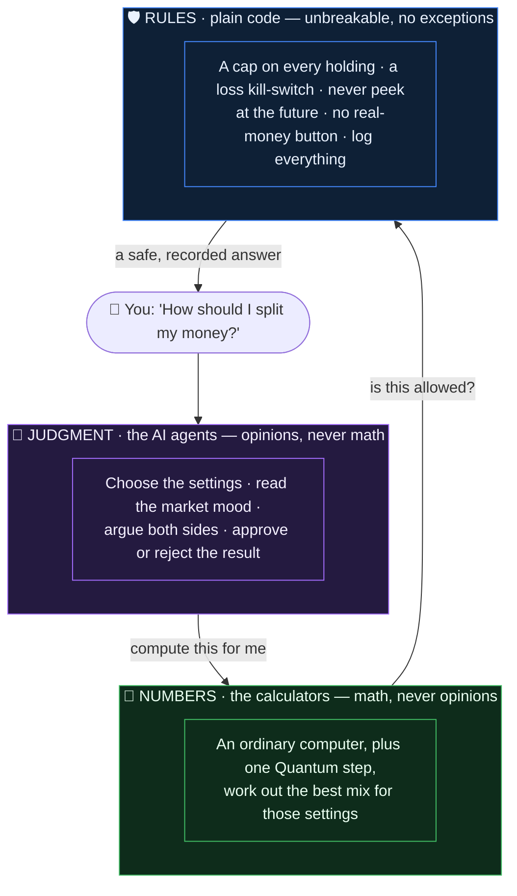
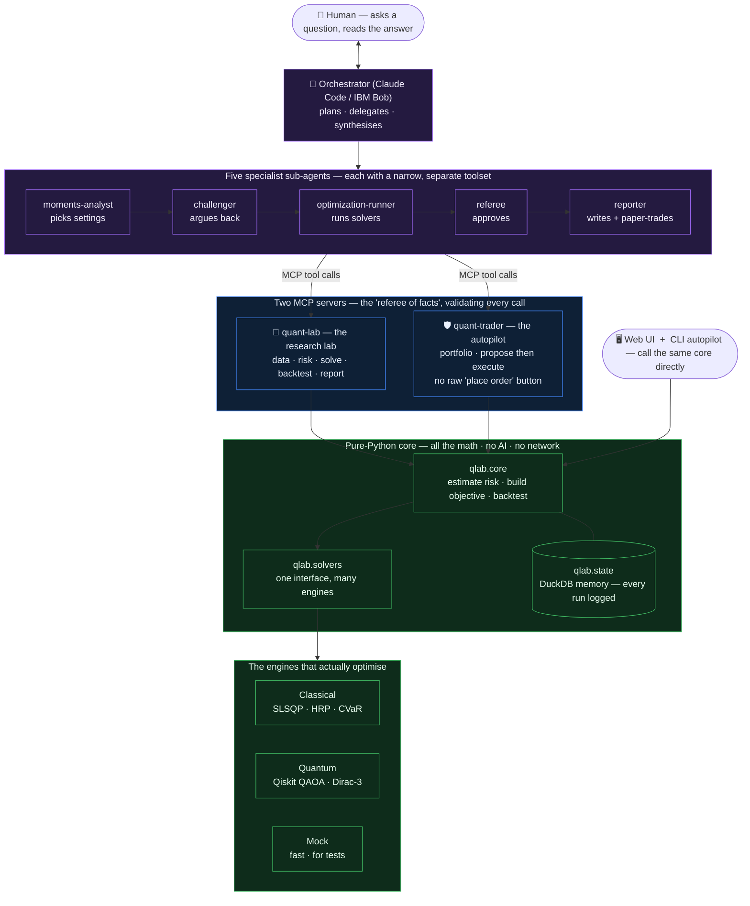
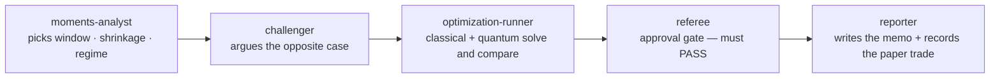

# qlab — an agentic quantum-enhanced quant research lab

> **IBM AI Builders — Wildcard: "Intelligent Systems for the Future of Work."**
> An agentic quant research desk that promotes its own validated policy into a
> mandated paper-trading autopilot.

**TradingAgents puts the LLM where the alpha is. We put the LLM where the
*judgment* is, and machines where the numbers are.**

Three layers, hard boundaries, everything logged:

| Layer | Owns | Never does |
|---|---|---|
| **Quantum** (Qiskit / Dirac-3) | portfolio weight optimization, higher-moment risk | act as a price oracle |
| **The LLM** (orchestrator + subagents) | *judgment* — estimation windows, shrinkage, regime calls, experiment design | compute a number, pick a trade |
| **Deterministic code** (`qlab.core` / `qlab.trader`) | *rigor* — constraints, look-ahead tripwires, trial counting, mandate limits | exercise judgment |

Four claims the code backs up:

- **The quantum claim** — *7 continuous variables on Dirac-3 vs ~434 logical
  qubits on gate hardware*, for the same degree-4 MVSK objective. Measured, not
  asserted: [`qlab/core/objective.py`](qlab/core/objective.py) builds the
  QUBO→Ising encoder and **counts** it (`qlab solve.qubo_resource_count`).
- **The AI claim** — the LLM never computes a number and never picks a trade; it
  picks *estimators* and *gates*, and every choice is logged, challenged, and
  scored against what actually happened (the reflection loop).
- **The honesty claim** — we built the arm that could falsify us
  (scenario-CVaR, [`qlab/solvers/cvar.py`](qlab/solvers/cvar.py)), the benchmark
  that usually wins (HRP, [`qlab/solvers/hrp.py`](qlab/solvers/hrp.py)), and the
  referee that can fail us ([`agents/referee.md`](agents/referee.md)).
- **The "future of work" claim** — this is what a research desk looks like when
  judgment is scaffolded by agents and rigor is enforced by machines.

---

## In plain English (no finance background needed)

**The everyday problem.** Say you have $10,000 and you want to spread it across a
handful of very different investments — global stocks, government bonds, gold,
real estate, commodities. The only real decision is **how much goes into each
one**. Put too much in one place and a single crash hurts you badly; spread it
blindly and you take risks you didn't need to. Choosing those percentages well is
called **portfolio allocation**, and it is the entire job of this tool.

**What "good" means here — and what we deliberately *don't* do.** We do **not**
try to predict which investment will go up. Predicting the future is notoriously
unreliable, and most tools that claim an edge are really just guessing. Instead we
minimise **risk** — and specifically the *bad* kind: the rare, sharp crashes, not
the normal day-to-day wiggle. (Finance calls this "higher moments"; in plain terms,
we care most about the size of the occasional gut-punch.) Sidestepping prediction
is also the honest move — nobody can accuse us of dressing up a lucky guess as
science.

**Why the tool is split into three layers.** Different steps need different kinds
of "brain":

- Some steps are **judgment calls** with no right answer — *how much of the recent
  past should we trust? Are we in a calm market or a panicky one?* No formula
  gives the answer, so an **AI** decides and writes down its reasoning.
- Some steps are **pure calculation** — *given those settings, what is the best
  mix?* A **math engine** (an ordinary computer, and for one specific step a
  **quantum** one) crunches it. No opinions, just numbers.
- Some steps are **unbreakable rules** — *never bet more than 40% on one thing;
  stop everything if losses hit 15%; never peek at tomorrow's prices.* These live
  in **plain, dumb code** the AI cannot talk its way around.

Keeping them apart is the whole point: the AI can't fudge a number, the calculator
can't make a judgment call, and the rules can't be argued with. Everything each
one does is logged.



**Two products, one engine.** The tool is really two things sharing one brain: a
**research lab** — a workbench where you try different methods and compare them
fairly (think flight *simulator*) — and an **autopilot** — once you've chosen a
method, a robot that runs it on **pretend money** under the strict rules above,
logging every move (think autopilot flying a plane, except the plane is paper).

**It cannot lose real money.** It only ever uses paper capital. There is no button
anywhere that places a real trade — that isn't switched off, it was never built. A
kill-switch halts everything if pretend losses cross a line.

**Where quantum computing actually fits.** Quantum computers are good at one thing
we need: searching an enormous space of combinations for the best one. We use it
**only** for the "find the best mix" step — never to predict prices. And we are
honest about its limits: we *measured* that doing our full math on today's
gate-model quantum hardware would need about **434 "qubits,"** while a specialised
machine (Dirac-3) needs just **7 variables**. That gap isn't a slogan — the tool
computes it for you in the Quantum tab.

### The intuition behind each design choice

| The choice | Why — in plain terms |
|---|---|
| **Optimise risk shape, not future returns** | Predicting prices is guessing; the *shape of risk* is far more stable and can be measured honestly. It also pre-empts the criticism "your edge is just a lucky forecast." |
| **"Shrink" and "denoise" the estimates** (Ledoit–Wolf, Marchenko–Pastur) | A small sample of history is noisy. We smooth it so we don't over-trust a fluke — like ignoring one weird review among a hundred normal ones. |
| **Feed the *same* math to the classical and quantum engines** | Apples-to-apples. If the two disagree, we know it's the *machine*, not the question — because they're provably solving the identical problem (property-tested). |
| **"Everything is a run" — log every experiment** | Results reproduce exactly, and we can *count how many things we tried*. Try 100 strategies and one looks great by pure luck; the "deflated Sharpe" correction subtracts that luck. |
| **Rules in code, not in the AI's prompt** | Words can be argued with; a hard-coded check cannot. An AI *told* "don't over-bet" can be talked out of it — a line of code that rejects the order can't. |
| **No raw "place order" tool** | Even a confused or hijacked AI physically *cannot* place an arbitrary trade — the only doors are "propose" and "execute a pre-approved plan." |
| **Two-step, idempotent trades** | If the power dies mid-trade, restarting won't double-buy — each order leg has a fixed fingerprint, so re-running is a no-op. |
| **Narrow-permission sub-agents + a referee** | Separation of duties, like a firm where the analyst can't also approve *and* execute. The referee's whole job is to **reject our own results** if they don't hold up. |
| **A "challenger" agent that argues the opposite** | Forces the judgment call to be *defended*, so a setting isn't just one person's opinion — both sides are recorded. |
| **Offline synthetic data by default** | A live demo can't be broken by a rate-limited data feed, and the numbers reproduce identically every time. Flip to `--online` for real market data. |

---

## Two products, one substrate (the technical picture)



**The key insight tying lab → autopilot:** stepped-mode backtest and live
trading are **the same loop with a different clock**. In the lab the server
advances a historical `as_of`; live, the clock is real and the commit routes to a
broker. Same tools, same decision log, same referee. See
[`qlab/core/backtest.py`](qlab/core/backtest.py).

---

## Quickstart (100% local, no accounts, no network)

```bash
python -m pip install -e .            # light core: numpy/pandas/scipy/duckdb/pydantic/pyyaml
python -m pip install -e ".[quantum,mcp]"   # optional: Aer QAOA + the MCP servers
python -m pip install -e ".[operator]" # optional: Textual console + Claude MCP proxy

# The terminal-native operator desk (offline synthetic data, paper book):
qlab tui

# The point-and-click way — launches the single-page UI and opens your browser:
qlab ui                               # everything below, without touching the CLI

# One full pipeline iteration against the offline synthetic feed, paper-traded:
qlab run-once --offline

# The reproducible experiment ablation (the submission numbers):
qlab batch configs/specs/ablation_v1.yaml --offline

# A recommendation with a real classical-vs-quantum comparison:
qlab recommend --offline --qaoa

# The standalone scheduled loop (poll → analyze → solve → paper-trade → log):
qlab watch --interval 15m --offline
```

Everything runs with **zero external accounts**. Optional integrations (live
data, IBM Quantum hardware, QCI Dirac-3, Alpaca paper) activate only when their
credentials are present — see [`.env.example`](.env.example).

> **Demo resilience.** Yahoo Finance intermittently rate-limits. Run
> `python scripts/prewarm_cache.py` before a demo, or pass `--offline` to serve
> the deterministic synthetic feed — a live demo cannot be taken down by a 429.

---

## How to run each surface

### 0. The single-page UI (no CLI needed)

```bash
qlab ui                 # http://127.0.0.1:8765 — opens automatically
qlab ui --online        # use live yfinance instead of the offline synthetic feed
qlab ui --port 9000 --no-browser
```

One self-contained page ([`qlab/ui/index.html`](qlab/ui/index.html), vanilla JS +
inline CSS, **no CDN** — so it works fully offline) backed by a tiny stdlib HTTP
server ([`qlab/ui/server.py`](qlab/ui/server.py)). Every capability is a panel:

| Panel | What it does |
|---|---|
| **Dashboard** | Live paper book — equity, cash, drawdown, kill-switch headroom, positions, target weights. Deploy / rebalance / heartbeat / reset buttons. |
| **Recommend** | The MVSK champion for an `as_of` date with skew/kurtosis λ sliders, estimator diagnostics, and a classical-vs-quantum comparison. |
| **Autopilot** | Run one iteration (with dry-run + QAOA toggles) or the daily-ops heartbeat; see the trade outcome and mandate status. |
| **Experiment** | Run the reproducible ablation; ranked results table + the Q-C architecture card. |
| **Quantum** | Live **434-vs-7** resource-count visualizer (n / r sliders) and a same-covariance classical-vs-QAOA compare. |
| **Registry** | Recent runs and the decision log + reflections. |
| **About** | The five-agent org chart with tool scopes, and the mandate limits. |

The server is single-dispatch (a lock serializes every request) so the shared
DuckDB book and the Aer runs stay consistent; it shares the same registry the
CLI and autopilot use, so the UI reflects the real paper portfolio.

> **What the UI's numbers actually mean** — see [`UI_VALIDITY.md`](UI_VALIDITY.md)
> for a tab-by-tab analysis of which figures are rigorous facts (the QUBO
> resource count, the QAOA optimality gap, the paper accounting), which are a
> reproducible *simulation* (returns/Sortino on the offline synthetic feed), and
> what you can and cannot claim from each tab.

### 0b. Terminal operator console

```bash
python -m pip install -e ".[operator]"
qlab tui                 # offline synthetic daily bars; paper book only
qlab tui --online        # live/cached yfinance daily bars
qlab tui --port 9000
```

The Textual console is a quiet, keyboard-first workstation with no global top
banner: navigation and universe context live in the left spine, the center
switches between Desk / Market / Research / Audit, agent authority stays visible
in the right rail, and events plus commands live at the bottom. It is an HTTP
client of the same single-owner UI runtime; it never opens DuckDB itself.

Core controls:

| Input | Action |
|---|---|
| `1`–`4` | Desk, Market, Research, Audit |
| `j` / `k` | Move through the universe |
| `5` | Focus the agent surface in a narrow terminal |
| `:` or `Ctrl-P` | Focus the universal command input |
| `~` | Expand/collapse the event timeline |
| `Ctrl-Q` | Quit |

Useful commands include `view market`, `symbol GLD`, `rebalance dry`, `daily`,
`batch`, `ask PROMPT`, and `help`. `rebalance paper` always opens an explicit
confirmation and is labeled paper-only.

Claude `ask` turns stream into the agent work rail with tools disabled. The
`governed` command instead launches a **propose-only** MCP session through
`qlab.mcp.tui_proxy`. That proxy never opens DuckDB: it calls the owner API and
can inspect market/portfolio state, read audit history, run daily ops/research,
and produce a dry rebalance proposal. It intentionally has no paper-execution
tool; execution stays human-confirmed even though the decision-bound referee,
reconciliation, mandate, and idempotency gates are now enforced in code. See
[`planning-docs/plans/2026-07-17-quiet-workstation-tui.md`](planning-docs/plans/2026-07-17-quiet-workstation-tui.md).

### 1. Interactive (orchestrator + subagents)

The two servers are registered in [`.mcp.json`](.mcp.json). Five subagents live
in [`agents/`](agents/) as the **orchestrator-agnostic source of truth**; the
loader emits both Claude Code and IBM Bob adapters:

```bash
python -m qlab.agents.loader sync     # → .claude/agents/*.md  and  .bob/personas/*.yaml
python -m qlab.agents.loader list     # show the org chart + tool scopes
```

Then, in a session in this project, ask for a recommendation. The pipeline flows
left to right, each stage a separate agent with its own narrow toolset:



Least privilege is enforced by tool allowlists: `moments-analyst` cannot call a
solver, `optimization-runner` cannot author a decision or trade, `referee` is
read-only, and only `reporter` can touch the execution gateway. **No agent has a
raw order tool** (see [`test_agents.py`](tests/test_agents.py)).

### 2. Standalone autopilot (`qlab` CLI)

```bash
qlab run-once   [--offline] [--dry-run] [--qaoa]   # one rebalance session
qlab daily-ops  [--offline]                        # heartbeat; reconcile+risk, NEVER trades
qlab watch      --interval 15m [--offline]         # the scheduled loop
qlab batch      configs/specs/ablation_v1.yaml     # the reproducible ablation
qlab recommend  [--as-of YYYY-MM-DD] [--offline]   # print an allocation, no trade
qlab prewarm    [--universe core|candidates]       # pre-fill the cache
qlab ui         [--port 8765] [--online]           # the single-page web UI
qlab tui        [--port 8765] [--online]           # terminal operator console
```

The daily-ops session's tool set structurally excludes execution — it *cannot*
trade, only flag drift/regime triggers.

### 3. Batch ablation (reproducible submission numbers)

`qlab batch` runs every arm below, holding all else constant and varying exactly
one thing, and writes them to the DuckDB registry. Because runs are
content-hashed, `git clone && qlab batch …` reproduces the numbers bit-for-bit —
the direct answer to TradingAgents' concession that its results don't reproduce.

---

## The experiment matrix ([`configs/specs/ablation_v1.yaml`](configs/specs/ablation_v1.yaml))

Each **arm** is one recipe. We change exactly one ingredient at a time so any
difference in the result is attributable to that ingredient — the scientific
control that makes the comparison trustworthy.

| Arm | Objective | Solver | What it tests |
|---|---|---|---|
| **B0** | 60/40 | — | Institutional benchmark |
| **B1** | Equal-weight (1/N) | — | Naive benchmark — famously hard to beat |
| **B2** | **HRP** | clustering | **The real bar** (robust to estimation error) |
| **B3** | Risk parity (ERC) | classical | Practitioner benchmark |
| **A1** | Min-variance | SLSQP | Classical MV baseline |
| **A2** | **Scenario-CVaR** | **LP** | **The falsifiable rival** — uses the distribution directly |
| **A3** | MVSK | multistart SLSQP | **Objective claim** — do higher moments help? |
| **A4** | MVSK | **Dirac-3** | **Solver claim** — better optima? (→ classical fallback w/o QCI) |
| **Q-A** | Selection QUBO (19→k) | **QAOA (Aer/QPU)** | The genuine gate-model slot; exact-checkable |
| **Q-B** | Discretized MV | **QAOA (Aer/QPU)** | Reality check + measured optimality gap |
| **Q-C** | MVSK→QUBO | resource count | **434 qubits vs 7 continuous vars — measured** |

Metrics ([`qlab/core/metrics.py`](qlab/core/metrics.py)) include realized skew/
kurtosis of the portfolio's *own* return series (did optimizing tail shape
deliver tail shape OOS?) and **deflated Sharpe** using the registry's trial
count — because ~70 quarterly points from 2008 is a small sample, we report
intervals and multiple-testing-adjusted numbers, not bare point estimates.

---

## The quantum story — three modalities, three jobs

Quantum is applied **only where its structure genuinely fits**:

- **Dirac-3 (continuous MVSK).** Degree-4 objective in **7 continuous
  variables**, native sum-to-R budget. This is the structural fit.
  [`qlab/solvers/dirac3.py`](qlab/solvers/dirac3.py) compiles the objective to
  the continuous-HUBO payload; with a QCI account it submits, without one it
  raises `Dirac3Unavailable` (attaching the payload) and the pipeline falls back
  to classical multistart.
- **Qiskit / QAOA (the genuinely binary slots).** The asset-selection QUBO
  (Q-A) and discretized MV (Q-B) run on the **Aer simulator today** (no IBM
  account needed) and on **real IBM QPU** when `IBM_QUANTUM_TOKEN` is set. At
  ≤21 qubits the exact ground state is enumerable, so we report a **rigorous
  optimality gap** — the selection QUBO reaches 100% approximation ratio; the
  discretized MV shows a measured few-percent gap.
- **The 434-qubit encoder (Q-C).** We *build the encoder and count* — n=7, r=4
  MVSK needs 28 weight qubits + 406 auxiliary/penalty qubits = **434 logical
  qubits, dense couplings** on 156-qubit Heron hardware. That count *is* the
  architecture argument (`mvsk_qubo_resource_count`, pinned in
  [`test_objective.py`](tests/test_objective.py)).

Integration finding (root-caused, per the plan): under **qiskit 2.5 /
qiskit-algorithms 0.4** the V1 `Sampler` is gone and QAOA needs the ansatz
transpiled for a V2 sampler — so QAOA is built with a `SamplerV2` + a preset
pass manager. Quantum tools run on the **main thread** (Aer + BLAS internals
corrupt off a worker pool). See [`qlab/solvers/quantum.py`](qlab/solvers/quantum.py).

`python scripts/scaling_chart.py` measures approximation quality + runtime vs
universe size (n=4…8) → `.lab/reports/scaling.{csv,png}`.

---

## Governance & safety

- **The mandate is code, not prompt.** [`mandate.yaml`](mandate.yaml) →
  [`qlab/trader/mandate.py`](qlab/trader/mandate.py): universe whitelist,
  long-only, per-asset caps, max turnover, daily order cap, marketable-limit
  only, and a **trailing-drawdown kill-switch** that halts all non-liquidating
  orders. Enforced before any plan can move from `proposed` to `checked`.
- **Two-phase, idempotent, resumable execution.** Order plans are registry
  objects with a `proposed→checked→submitted→filled→reconciled` state machine;
  `client_order_id = hash(plan_id, leg)` makes execution idempotent, so a session
  dying mid-rebalance resumes instead of double-ordering
  ([`qlab/trader/plan.py`](qlab/trader/plan.py)).
- **No raw order tool.** The autopilot gets `propose_rebalance` / `execute_plan`,
  never `place_order` — the mandate can't be bypassed by a prompt. Paper mode is
  hard-coded; **live trading is unimplemented by design**, not merely disabled.
- **Server-side guardrails** ([`qlab/mcp/guardrails.py`](qlab/mcp/guardrails.py)):
  pydantic schemas, an `as_of` look-ahead tripwire, constraint validation, and a
  per-session call-budget ledger. The **server is the referee of facts; the
  agent is the author of choices.**
- **No text inputs in the trading loop.** Inputs stay strictly numeric (prices,
  positions, fills) — text from the market is a prompt-injection surface an
  autonomous trader shouldn't have.

---

## Package layout

```
qlab/
  core/       types · universe · data (offline synth + cache) · moments
              (Ledoit–Wolf, RMT denoise, co-moment shrinkage) · objective
              (3 compilers) · backtest · metrics
  solvers/    base (Solver protocol + registry) · classical · hrp · cvar ·
              quantum (Aer QAOA) · dirac3 (QCI adapter) · mock
  state/      registry (DuckDB) · artifacts (content-addressed JSON)
  mcp/        guardrails · quant_lab · quant_trader
  trader/     mandate · broker (simulated paper + Alpaca) · plan (state machine)
  agents/     loader (neutral agents/*.md → Claude + Bob adapters)
  ui/         server (stdlib HTTP + JSON API) · index.html (single-page app)
  autopilot/  loop · cli
  arms.py     the experiment matrix, wired
  experiment.py  batch ablation + single-shot recommendation
agents/       the 5 subagent definitions (source of truth)
configs/      universe.yaml · specs/ablation_v1.yaml
scripts/      prewarm_cache.py · scaling_chart.py
tests/        52 tests, all offline
```

---

## Reproducibility & testing

```bash
python -m pytest        # 52 tests, fully offline (synthetic data + in-memory DuckDB)
```

Determinism is a first-class invariant: the synthetic feed seeds off a **stable
hash** (not Python's per-process salted `hash()`), so the ablation reproduces
across processes; per-test DB isolation keeps the suite order-independent. The
objective's scipy compiler is property-tested against a brute-force polynomial so
solver arms provably optimize the *same* thing.

---

## Extension points (interfaces complete; external deps adapter-stubbed)

Everything below already has its interface and, where possible, its encoder —
only the external credential/hardware is missing:

| Extension | Status | Where |
|---|---|---|
| **QCI Dirac-3** (arm A4) | encoder + submission path built; needs `QCI_API_TOKEN` | `qlab/solvers/dirac3.py` |
| **IBM QPU** (Q-A/Q-B on hardware) | Aer works now; set `IBM_QUANTUM_TOKEN` to sample the final circuit on Heron | `qlab/solvers/quantum.py` |
| **Alpaca paper broker** | adapter built (paper hard-coded); needs `ALPACA_API_KEY` | `qlab/trader/broker.py` |
| **IBM Bob** | personas emitted from the neutral agent source | `qlab/agents/loader.py` |
| **Options-implied moments** (BKM) | named road-map slot; shrinkage-target hook in `co_moments` | `qlab/core/moments.py` |
| **Gurobi / other solvers** | satisfy the one `Solver` protocol | `qlab/solvers/base.py` |

---

## Honest limitations

- At n=7, classical multistart will likely **tie** the quantum arm — said up
  front. The solver claim lives at 15–19 assets; the objective claim at n=7.
- ~70 quarterly rebalance points is a **small sample**. The backtest carries the
  statistical claim; the live paper book carries the credibility claim (it runs
  unattended, respects its mandate, logs its reasoning, survives real plumbing).
- If scenario-CVaR (A2) beats MVSK out of sample, **that is the finding** — we
  built the arm that could falsify the thesis and we report it either way.
- On the **offline synthetic feed, all performance numbers are a reproducible
  simulation, not a market finding** — see [`UI_VALIDITY.md`](UI_VALIDITY.md).

---

## Disclaimer

Research scaffold, not investment advice. Paper capital only; the system never
places a real order. Provided under the MIT license.
