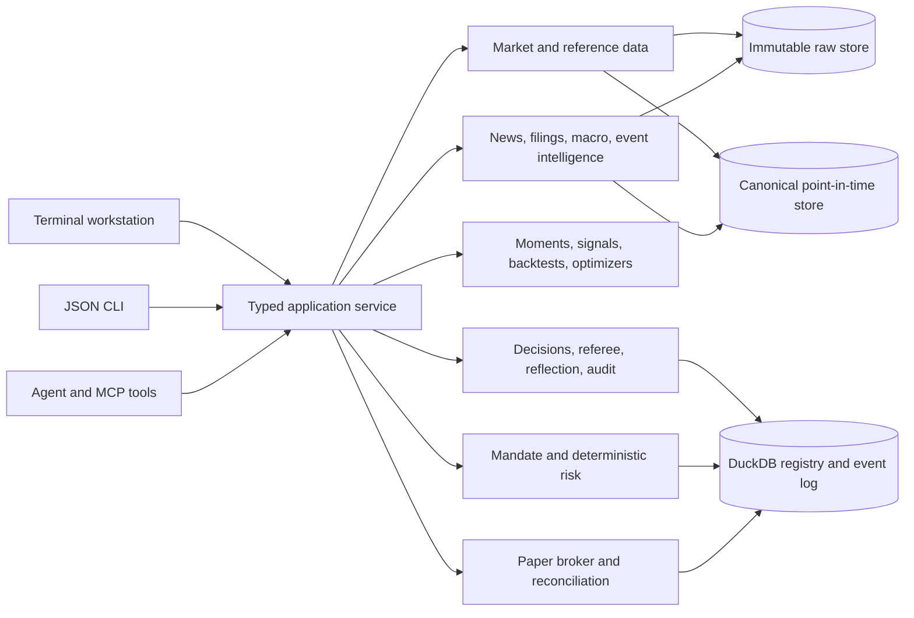

# Four-Phase Financial Workstation Implementation Plan

**Status:** Active  
**Date:** 2026-07-17  
**Current phase:** Phase 1 — Trust and data foundation

## Goal

Turn the current research lab and paper-trading loop into a clean,
terminal-native financial workstation in which humans and AI agents see the same
facts, call the same typed operations, and cannot bypass deterministic risk,
approval, or audit boundaries.

The TUI is the face of the system, not the system itself. It should remain quiet,
keyboard-first, and border-light, with **no decorative global top header**.
Navigation and instrument context live in the left spine; the center is the
active market/work surface; the right rail shows agent work, evidence, and
structured proposals; the bottom strip owns commands and transient status.

## Assumptions and hard boundaries

- The seven-asset core remains the controlled allocation and paper-execution
  universe while the 19-instrument pool remains available for selection research.
- Paper trading is the only execution mode in these four phases. Live-money
  execution requires a separate authorization and production-readiness review.
- The LLM may research, extract, challenge, and propose. It may not calculate
  authoritative portfolio numbers or turn prose directly into an order.
- Every market, macro, filing, and news datum carries source time, ingestion time,
  provider, lineage, revision/quality state, and point-in-time availability.
- One process owns mutable runtime state. The TUI, CLI, MCP tools, and future web
  clients call the same typed application services rather than opening competing
  broker or database sessions.
- Offline synthetic fixtures remain first-class so tests and demos never depend
  on a network service.

## Target architecture



The important flow is structural:

```text
source data -> canonical fact -> research artifact -> structured decision
            -> deterministic referee/risk gate -> approved plan -> paper fill
            -> realized outcome -> reflection -> next decision context
```

## Phase 1 — Trust and data foundation

### Outcome

Every result and paper fill is reproducible, replay-safe, point-in-time, and
traceable to healthy source data. This phase includes completion of the active R0
trust-repair plan.

### Build

1. Close R0-T7 through R0-T12:
   - leg-level order idempotency;
   - an explicit challenger view in automated decisions;
   - deterministic resolution of pending decisions and stored reflections;
   - tool-call event emission;
   - sample-size-driven co-moment shrinkage and selectable targets; and
   - the complete offline/online exit gate.
2. Define provider-neutral protocols for prices, quotes, instrument metadata,
   calendars, macro series, filings, and news.
3. Add canonical envelopes with:
   - `observed_at`, `available_at`, `ingested_at`, and optional `revised_at`;
   - provider and provider record ID;
   - instrument/entity IDs rather than ticker-only identity;
   - quality, staleness, entitlement, and lineage metadata; and
   - content hashes for replay and deduplication.
4. Add an instrument master for ETF/trust structure, issuer, exposure, currency,
   exchange, calendar, benchmark, expense ratio, liquidity, distributions,
   corporate actions, and active date range.
5. Add source-health and freshness operations exposed identically to TUI, CLI,
   and MCP.
6. Integrate sources in descending value/risk order:
   - existing price cache/offline generator;
   - Alpaca paper/account and current market data where credentials exist;
   - FRED/ALFRED macro data with revision-aware vintages;
   - SEC EDGAR filings and company facts; then
   - a licensed market/news provider only after entitlement requirements are
     explicit.

### TUI slice

- Add a data-health view reachable from the left spine.
- Put small source-age and degradation markers beside affected facts, not in a
  global banner.
- Keep stale/degraded details in a focusable inspector and event timeline.
- Show replay/paper mode and risk authority in the command/status strip.

### Acceptance criteria

- Replaying an approved plan cannot move cash or positions twice.
- Every decision either remains pending for a valid reason or resolves exactly
  once with an outcome and reflection.
- Every tool call and consequential state transition appears in the event log.
- A snapshot can prove that no datum unavailable at `as_of` entered a run.
- Provider failure degrades to cached/offline behavior without corrupting state.
- All R0 tests and exit-gate commands pass.

## Phase 2 — Evidence-linked intelligence

### Outcome

Agents receive timely news, filings, and macro context as structured, cited,
read-only evidence. Facts, model interpretation, uncertainty, and portfolio views
are distinct objects.

### Build

1. Store raw documents immutably, including source URL, publisher, timestamps,
   retrieval metadata, terms/entitlement, language, and content hash.
2. Normalize and deduplicate by canonical URL, text fingerprint, syndication,
   and event clustering.
3. Resolve companies, funds, countries, commodities, sectors, and tickers through
   the instrument/entity master with confidence scores.
4. Introduce a typed `EventFact` schema:
   - event type and entities;
   - asserted fact and numeric values;
   - effective/source/available timestamps;
   - supporting spans and citations;
   - novelty, confidence, contradictions, and extraction model/version.
5. Add LLM extraction behind a quarantine boundary. Invalid schema, unsupported
   claims, missing citations, or stale inputs are rejected before agents see
   them.
6. Convert accepted events only into bounded risk/regime views. They may adjust
   research priors or trigger an experiment; they may not directly create an
   order.
7. Expose read-only operations such as:
   - `news.search`, `events.list`, `events.explain`, `filings.latest`;
   - `macro.series`, `macro.vintage`; and
   - `evidence.for_decision`.

### TUI slice

- Add an Intelligence work surface with a compact event stream, selected-event
  evidence card, contradictions, affected exposures, freshness, and provenance.
- Agent conclusions show thesis, evidence, counter-evidence, uncertainty,
  invalidation, and timestamps—never hidden chain-of-thought.
- Longer Claude Code work stays in the right rail or an adjacent terminal pane;
  it must not replace the live market surface.

### Acceptance criteria

- Every extracted fact links back to source material and point-in-time metadata.
- Repeated/syndicated stories do not multiply signal weight.
- Evaluation fixtures measure extraction precision, entity resolution, citation
  coverage, latency, and contradiction handling.
- Prompt injection in source text cannot invoke tools or cross the proposal gate.
- MCP access to intelligence is read-only and audited.

## Phase 3 — Signal science and portfolio/index laboratory

### Outcome

The application can determine whether an intelligence view or portfolio rule has
historical evidence, remains calibrated out of sample, and deserves promotion.
It also becomes a credible laboratory for transparent custom ETF-like model
portfolios and indices.

### Build

1. Create point-in-time event replay joined to tradable prices, calendars,
   spreads, and corporate actions.
2. Add event studies with predeclared horizons, controls, confidence intervals,
   placebo dates, multiple-testing correction, and leakage checks.
3. Add a versioned signal registry containing inputs, transformations, owner,
   universe, expected mechanism, validity range, calibration, trial family,
   promotion state, and retirement reason.
4. Measure directional accuracy only where declared; primarily evaluate changes
   in realized volatility, correlation, tail behavior, drawdown, turnover, and
   diversification because those match the risk-only portfolio objective.
5. Add walk-forward and regime-stratified validation, benchmark comparison,
   transaction-cost/slippage sensitivity, and capacity/liquidity limits.
6. Build an index/model-portfolio workbench:
   - eligibility and exclusion rules;
   - selection and weighting methodologies;
   - rebalance calendars and buffers;
   - constituent history and turnover;
   - benchmark, factor, sector, geography, liquidity, and concentration views;
   - methodology versioning and human approval; and
   - reproducible factsheets and change logs.
7. Require referee PASS plus deterministic promotion criteria before a signal or
   methodology enters the paper autopilot.

### TUI slice

- Add Research and Index Lab surfaces with experiment comparison, walk-forward
  results, regime breakdown, current constituents, proposed rebalance, and an
  audit trail.
- Charts expand only when focused; tables, evidence, and agent activity retain
  space when the chart is ambient.
- A proposal is a typed component with reject, simulate/paper, and inspect-risk
  actions—never prose buried in chat.

### Acceptance criteria

- No experiment can use a document, revision, constituent, or price unavailable
  at its simulated timestamp.
- Trial counts and promotion families are explicit; confidence intervals and
  deflated performance metrics accompany results.
- A methodology version reproduces the same historical constituents and weights.
- A promoted signal beats its declared baselines under walk-forward, cost, and
  placebo tests or is rejected.

## Phase 4 — Durable real-time paper operations

### Outcome

A single long-running runtime continuously ingests data, coordinates agents,
evaluates approved policies, executes bounded paper plans, and gives the operator
an auditable mission-control view.

### Build

1. Introduce one runtime owner with supervised connectors, bounded queues,
   backpressure, reconnect/catch-up semantics, and deterministic event ordering.
2. Add typed runtime state for feeds and agents: `starting`, `healthy`,
   `degraded`, `stale`, `retrying`, `waiting_approval`, `blocked`, and `stopped`.
3. Persist broker acknowledgements, partial fills, rejects, cancels, fees,
   slippage, and reconciliation results as first-class events.
4. Add alert policies for stale feeds, missed heartbeats, unresolved decisions,
   mandate pressure, reconciliation breaks, rejected proposals, and kill-switch
   transitions.
5. Add scheduler/calendar ownership, restart recovery, snapshots, retention,
   backup, schema migration, secrets rotation, and operator runbooks.
6. Add ETF-specific operational feeds only where licensed and useful: holdings,
   creations/redemptions or flows, NAV/premium-discount, distributions,
   rebalances, borrow/liquidity, and options surfaces.
7. Add session/cost/tool-budget accounting and explicit agent permissions:
   `OBSERVE`, `RESEARCH`, `PROPOSE`, `PAPER`. `LIVE` remains unavailable.

### TUI slice

- Turn the right rail into compact multi-agent mission control with role,
  permission, task, evidence age, tool activity, and waiting/blocked state.
- Add an event/action timeline connecting source update, signal, research,
  referee, proposal, approval, order, fill, reconciliation, and reflection.
- Use neutral color by default; accent for focus, green/red only for financial
  direction or execution, amber for stale/pending, and strong red for a breached
  hard limit or kill-switch.
- Keep a universal command palette as the main action vocabulary; shortcuts are
  accelerators, not hidden functionality.

### Acceptance criteria

- Restarting during any order lifecycle converges to the correct state without a
  duplicate fill.
- Feed loss, broker errors, full queues, malformed events, and agent/tool failure
  have tested degradation and recovery behavior.
- The operator can reconstruct why any position exists from evidence through
  reflection without reading raw logs.
- Paper operation survives a multi-day soak test with no unreconciled state,
  unbounded memory growth, or silent data staleness.

## Cross-phase contracts

### Shared operation model

Every meaningful action is a named typed operation, for example:

```text
market.snapshot          data.health             events.list
research.run             decision.inspect        evidence.for_decision
proposal.preview         proposal.reject         proposal.paper_execute
risk.check               orders.cancel           portfolio.reconcile
```

The TUI renders operations, the JSON CLI serializes them, and agents call them
through MCP. Business logic belongs in none of those adapters.

### Core record chain

| Record | Immutable identity | May authorize execution? |
|---|---|---:|
| Source document / market datum | Provider ID + content hash + availability time | No |
| Extracted event fact | Fact hash + cited evidence + extractor version | No |
| Research artifact | Inputs + code/config version + as-of time | No |
| Agent decision | Structured choice + evidence + challenger + uncertainty | No |
| Referee verdict | Decision/target hash + reasons + policy version | Only PASS advances |
| Order proposal/plan | Decision + target + mandate + leg IDs | Only after PASS/checks |
| Fill/reconciliation | Broker/client IDs + event sequence | Records result only |
| Outcome/reflection | Decision + horizon + realized data version | Influences future research only |

### Revisit points

- Revisit the seven-asset execution core only after Phase 1 is green and the
  candidate-selection/paper evidence supports expansion.
- Revisit vendor selection when exact latency, history, geography, redistribution,
  and budget requirements are known; do not couple canonical schemas to a vendor.
- Revisit Rust/Ratatui only after profiling proves Textual or the Python runtime
  cannot meet measured update/latency/reliability needs.
- Revisit registered-fund ambitions only after the model/index methodology has a
  governed history and legal/compliance partners define the wrapper.
- Revisit live-money execution only through a new threat model, permissions
  model, deployment review, operational controls, and explicit user authorization.

## Implementation order from the current checkout

1. Finish `planning-docs/plans/2026-07-17-r0-trust-repair.md` Tasks 7–12.
2. Mark plan checkboxes/status from verified code and tests, not commit messages.
3. Add Phase 1 provider/data-envelope interfaces without replacing the existing
   offline/Yahoo-compatible path.
4. Surface data health in the existing quiet workstation layout.
5. Start Phase 2 only after the point-in-time/lineage contract has tests.

No extra plugin or runtime dependency is required to finish R0. New providers
should be optional extras and imported lazily so the offline core remains small
and reliable.
